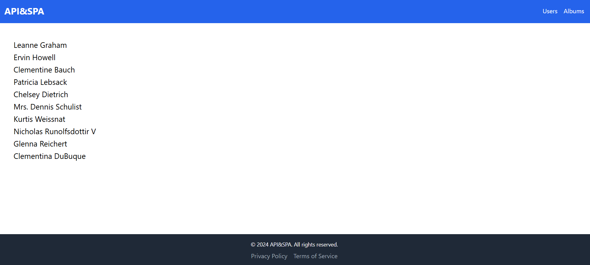

# Lamoda - Online Store



## Description
This project is a web application that connects to JSON Placeholder, allowing users to fetch and view user data, their albums, and associated photos. The application is designed to handle fetch operations efficiently, providing smooth loading experiences to enhance user interaction.

## Technologies
- React: A library for building user interfaces.
- TailwindCSS: A utility-first CSS framework for rapid UI development.
- Vite: A modern build tool for fast development of applications.
- React Router Dom: A modern router for single page applicaions.

## Installation
 - Clone the repository:
    ```bash
    git clone https://github.com/Navi-Friend/api-spa
    ```

 - Navigate to the project directory:
    ```bash
    cd api-spa
    ```

 - Install the dependencies:
    ```bash
    npm install
    ```
 - Run the application:
    ```bash
    npm run dev
    ```

 - Open your browser

## Features
 - Fetch and display a list of users.
 - Retrieve and view albums for each user.
 - Show photos associated with each album.
 - Smooth loading and error handling for better performance.
